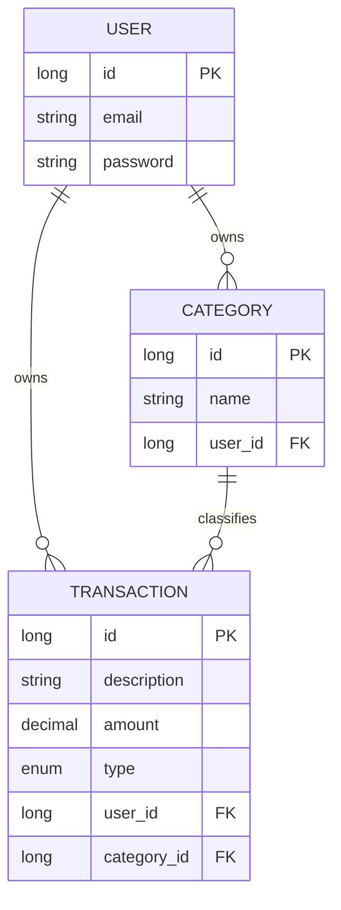

# finance-api


API REST para controle de finanças pessoais, desenvolvida em **Java 17** com **Spring Boot**. Permite que cada usuário gerencie suas próprias transações financeiras e categorias, com autenticação segura via **JWT**.

## Visão geral

O projeto foi estruturado em camadas (Controller, Service, Repository) seguindo princípios de **Clean Architecture** e **SOLID**, com foco em:

- Autenticação e autorização stateless com **Spring Security + JWT**
- Persistência de dados relacionais com **Spring Data JPA**
- Tratamento global de exceções (`GlobalExceptionHandler`) para respostas de erro padronizadas
- Validação de entrada com **Bean Validation**
- Testes unitários com **JUnit 5 + Mockito**
- Containerização completa com **Docker** e **Docker Compose**
- Uso de **DTOs** de entrada (`Request`) e saída (`Response`) para desacoplar a API da camada de persistência e expor apenas os dados necessários

## Stack

- Java 17
- Spring Boot
- Spring Data JPA / Hibernate
- Spring Security + JWT
- PostgreSQL
- Maven
- Lombok
- JUnit 5 / Mockito
- Springdoc OpenAPI (Swagger)
- Docker / Docker Compose

## Modelo de dados

Cada usuário possui suas próprias transações e categorias. Toda transação pertence a um usuário e está associada a uma categoria.



## Endpoints

### Autenticação (`/auth`)

| Método | Endpoint | Descrição |
|--------|----------|-----------|
| POST | `/auth/register` | Registra um novo usuário |
| POST | `/auth/login` | Autentica o usuário e retorna um token JWT |

### Categorias (`/categories`)

| Método | Endpoint | Descrição |
|--------|----------|-----------|
| GET | `/categories` | Lista as categorias do usuário autenticado |
| GET | `/categories/{id}` | Busca uma categoria específica |
| POST | `/categories` | Cria uma nova categoria |
| PUT | `/categories/{id}` | Atualiza uma categoria existente |
| DELETE | `/categories/{id}` | Remove uma categoria |

### Transações (`/transactions`)

| Método | Endpoint | Descrição |
|--------|----------|-----------|
| GET | `/transactions` | Lista as transações do usuário autenticado |
| GET | `/transactions/{id}` | Busca uma transação específica |
| POST | `/transactions` | Cria uma nova transação |
| PUT | `/transactions/{id}` | Atualiza uma transação existente |
| DELETE | `/transactions/{id}` | Remove uma transação |

> Todos os endpoints (exceto `/auth/**`) exigem um token JWT válido no header `Authorization: Bearer <token>`.

## Documentação interativa (Swagger)

Com a aplicação em execução, a documentação completa da API fica disponível em:

http://localhost:8080/swagger-ui/index.html

É possível autenticar diretamente pela interface: gere um token em `/auth/login`, clique em **Authorize** e cole o token para testar os endpoints protegidos.

## Tratamento de exceções

A API utiliza um `@RestControllerAdvice` global (`GlobalExceptionHandler`) para capturar exceções customizadas e retornar respostas de erro padronizadas (`ErrorResponse`):

- `ResourceNotFoundException` — recurso não encontrado (404)
- `EmailAlreadyInUseException` — tentativa de registro com e-mail já cadastrado (409)
- Erros de validação (`@Valid`) — campos inválidos no corpo da requisição (400)

## Segurança

A autenticação é feita via JWT, com os seguintes componentes:

- `JwtService` — geração e validação de tokens
- `JwtAuthFilter` — filtro que intercepta requisições e valida o token
- `SecurityConfig` — configuração de segurança e regras de acesso
- `UserDetailsServiceImpl` — carregamento dos dados do usuário para autenticação

Senhas são armazenadas com hash via `BCryptPasswordEncoder`.

## Testes

O projeto conta com testes unitários utilizando **JUnit 5** e **Mockito**, cobrindo os principais cenários de sucesso e erro da camada de serviço.

```bash
./mvnw test
```

## Como executar

### Opção 1 — Docker (recomendado)

Com Docker e Docker Compose instalados, basta um único comando para rodar a API e o banco de dados PostgreSQL juntos, sem precisar instalar nada manualmente:

```bash
git clone https://github.com/gothsins/finance-api.git
cd finance-api
docker compose up --build
```

A API estará disponível em `http://localhost:8080`.

### Opção 2 — Execução local

```bash
git clone https://github.com/gothsins/finance-api.git
cd finance-api
```

Configure as variáveis de ambiente do banco de dados (veja `application-example.properties`) e execute:

```bash
./mvnw spring-boot:run
```

## Status do projeto

CRUD completo para `Category` e `Transaction`, com autenticação JWT, validações, testes unitários, documentação Swagger e containerização Docker. Próximas melhorias incluem filtros de busca (por categoria, período, tipo) e endpoint de resumo financeiro agregado.
