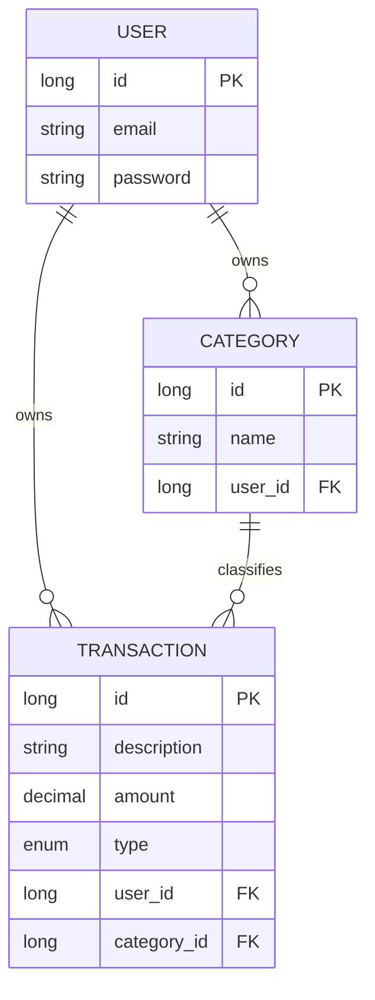

# finance-api

API REST para controle de finanças pessoais, desenvolvida em **Java 17** com **Spring Boot**. Permite que cada usuário gerencie suas próprias transações financeiras e categorias, com autenticação segura via **JWT**.

## Visão geral

O projeto foi estruturado em camadas (Controller, Service, Repository) seguindo princípios de **Clean Architecture** e **SOLID**, com foco em:

- Autenticação e autorização stateless com **Spring Security + JWT**
- Persistência de dados relacionais com **Spring Data JPA**
- Tratamento global de exceções (`GlobalExceptionHandler`) para respostas de erro padronizadas
- Uso de **DTOs** para desacoplar a API da camada de persistência

## Stack

- Java 17
- Spring Boot
- Spring Data JPA / Hibernate
- Spring Security + JWT
- PostgreSQL
- Maven
- Lombok

## Modelo de dados

Cada usuário possui suas próprias transações e categorias. Toda transação pertence a um usuário e está associada a uma categoria.



## Endpoints

### Autenticação (`/auth`)

| Método | Endpoint | Descrição |
|--------|----------|-----------|
| POST | `/auth/register` | Registra um novo usuário |
| POST | `/auth/login` | Autentica o usuário e retorna um token JWT |

### Categorias (`/categories`)

| Método | Endpoint | Descrição |
|--------|----------|-----------|
| GET | `/categories` | Lista as categorias do usuário autenticado |
| GET | `/categories/{id}` | Busca uma categoria específica |
| POST | `/categories` | Cria uma nova categoria |
| DELETE | `/categories/{id}` | Remove uma categoria |

### Transações (`/transactions`)

| Método | Endpoint | Descrição |
|--------|----------|-----------|
| GET | `/transactions` | Lista as transações do usuário autenticado |
| GET | `/transactions/{id}` | Busca uma transação específica |
| POST | `/transactions` | Cria uma nova transação |
| DELETE | `/transactions/{id}` | Remove uma transação |

> Todos os endpoints (exceto `/auth/**`) exigem um token JWT válido no header `Authorization: Bearer <token>`.

## Tratamento de exceções

A API utiliza um `@RestControllerAdvice` global (`GlobalExceptionHandler`) para capturar exceções customizadas e retornar respostas de erro padronizadas (`ErrorResponse`):

- `ResourceNotFoundException` — recurso não encontrado (404)
- `EmailAlreadyInUseException` — tentativa de registro com e-mail já cadastrado (409)

## Segurança

A autenticação é feita via JWT, com os seguintes componentes:

- `JwtService` — geração e validação de tokens
- `JwtAuthFilter` — filtro que intercepta requisições e valida o token
- `SecurityConfig` — configuração de segurança e regras de acesso
- `UserDetailsServiceImpl` — carregamento dos dados do usuário para autenticação

Senhas são armazenadas com hash via `BCryptPasswordEncoder`.

## Como executar

```bash
git clone https://github.com/gothsins/finance-api.git
cd finance-api
```

Configure as variáveis de ambiente do banco de dados (veja `application-example.properties`) e execute:

```bash
./mvnw spring-boot:run
```

## Status do projeto

Em desenvolvimento ativo — próximas melhorias incluem endpoints de atualização (`PUT`/`PATCH`) para transações e categorias, e relatórios financeiros agregados.
